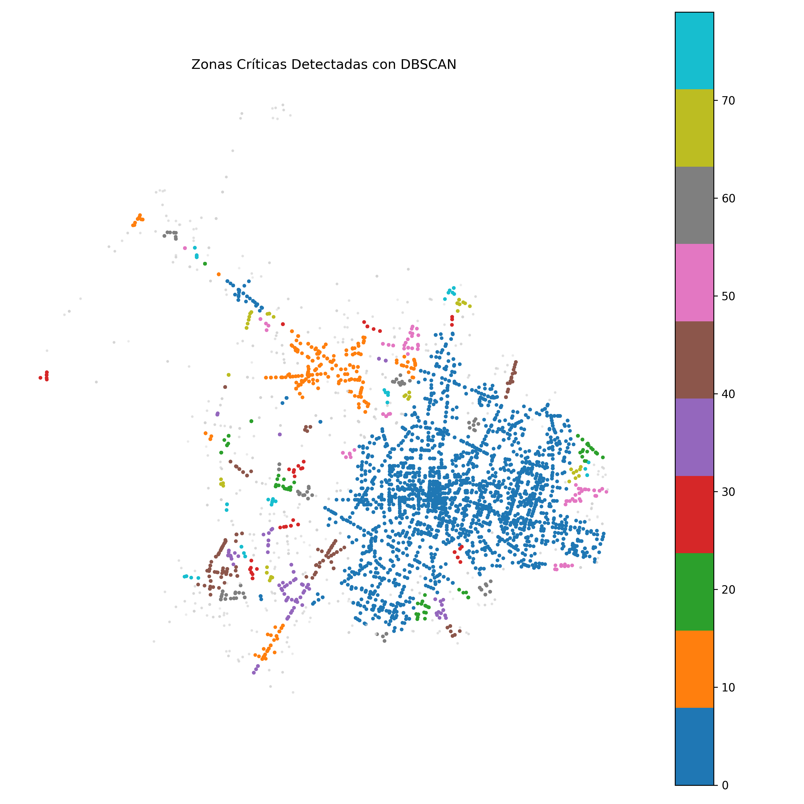
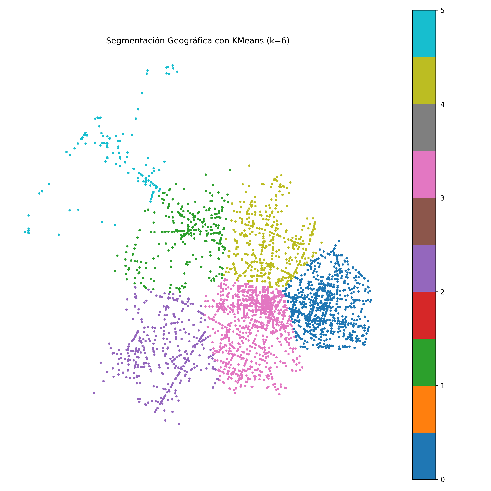

# Análisis de Siniestros Viales en Guadalajara y Zapopan (2019–2024)

Este proyecto realiza un análisis completo de los siniestros viales ocurridos en Guadalajara y Zapopan entre 2019 y 2024, utilizando datos georreferenciados, técnicas de visualización espacial y modelos de agrupamiento (clustering). El objetivo es identificar zonas críticas y brindar insumos útiles para la toma de decisiones en movilidad y seguridad vial.

## Contenido

- Exploración de datos y distribución temporal
- Visualización espacial de siniestros (estáticos e interactivos)
- Detección de zonas críticas con DBSCAN y KMeans
- Estadísticas por tipo de usuario y severidad
- Recomendaciones por zona y tipo de riesgo

## Estructura del proyecto

```
├── data/
│   ├── accidentes_zapopan_gdl_19_25_raw.csv
│   ├── accidentes_shapes_new.geojson
│   ├── accidentes_shapes.geojson
│   └── accidentes_cleaned.csv
├── notebooks/
│   ├── 01_limpieza_geodf.ipynb
│   ├── 02_analisis_exploratorio.ipynb
│   ├── 03_analisis_geoespacial.ipynb
│   ├── 04_clustering_zonas_criticas.ipynb
├── outputs/
│   ├── mapa_estatico_accidentes.png
│   ├── mapa_calor_accidentes.html
│   ├── mapa_fallecidos.html
│   ├── dbscan_segmentacion_geografica.png
│   ├── kmeans_segmentacion_geografica.png
│   ├── dbscan_statistics.csv
│   └── kmeans_statistics.csv
├── results/
│   ├── Resultados_Finales.pdf
├── README.md
└── requirements.txt
```

## Cómo reproducir

1. Clona el repositorio:
```bash
git clone https://github.com/hectoroleon/Accidentes_GDL_Zapopan.git
cd Accidentes_GDL_Zapopan
```

2. Crea un ambiente virtual y actívalo:
```bash
conda create -n siniestros python=3.10
conda activate siniestros
```

3. Instala las dependencias:
```bash
pip install -r requirements.txt
```

4. Abre los notebooks:
```bash
jupyter lab
```

## Requisitos principales

- `pandas`, `numpy`, `matplotlib`, `seaborn`
- `geopandas`, `folium`, `contextily`
- `scikit-learn`, `shapely`

## Visualizaciones de ejemplo

- 📍 [Mapa de calor interactivo de siniestros](./outputs/mapa_calor_accidentes.html)
- ⚫ [Mapa interactivo de fallecimientos](./outputs/mapa_fallecidos.html)
- 🗺️ Segmentación con DBSCAN:
  
- 🗺️ Segmentación con KMeans:
  

## Fuente de datos

Los datos utilizados fueron obtenidos del portal **Siniestralimap**, del Instituto de Información Estadística y Geográfica de Jalisco (IIEG):  
🔗 [https://iieg.gob.mx](https://iieg.gob.mx)

## Créditos

Proyecto desarrollado por [Tu Nombre], abril 2025.  
Este análisis forma parte de una propuesta para mejorar la seguridad vial mediante el uso de datos abiertos y técnicas de ciencia de datos.

---

**Nota:** Los mapas interactivos pueden abrirse directamente desde la carpeta `outputs/` en un navegador web.
